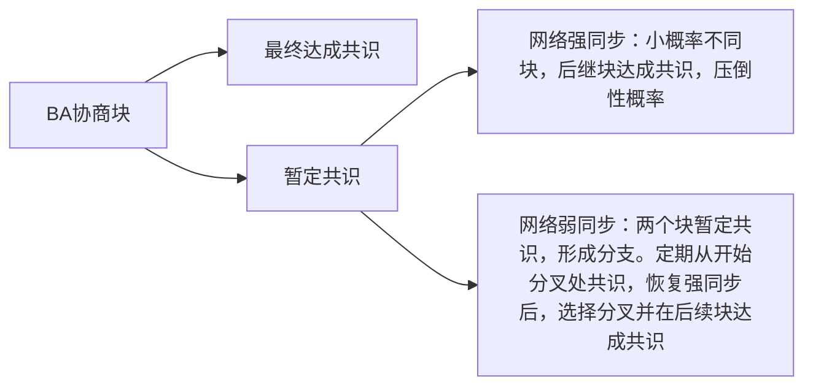
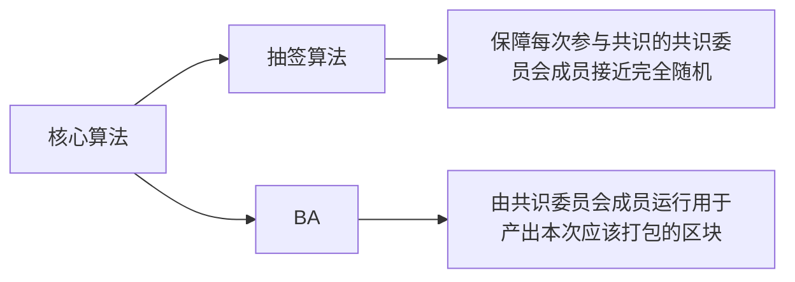

# $Algorand: Scaling Byzantine Agreements for   Cryptocurrencies $

## 摘要

$Algorand$：一种新的加密货币，**在扩展到许多用户时可以确认时延为一分钟（几乎不分叉）的交易。 即使有一些恶意用户并且网络被临时分区也能确保用户不会对已确认的交易有不同的view。**

使用一种新的Byzantine Agreement（BA）protocol； 使用**基于$VRFs$的新机制来将共识扩展到许多用户**

在$Algorand$的BA协议中，**除了用户的私钥外，用户不保存他们的任何私有状态，这使得用户发送完消息后立即更换参与者==>缓解了参与者身份暴露后的针对性攻击**

## 1、介绍

目前在交易延迟和交易信任之间取得平衡。

### 1.1、**核心问题：双花攻击。**

目前解决方法，在区块链（有序日志）中达成共识阻止双重支付。攻击；女巫攻击。

解决办法，工作量证明（Pow，比特币），最长链为权威链，防止女巫攻击。允许分叉的可能性，两个不同的块链具有相同的长度，不会互相取代。减轻分叉：用一个块增长链的时间要高（比特币10 min）；等待几个块之后再确认（比特币6个块）

### 1.2、**本算法：$$Algorand$$**

一种新的加密机制，旨在一分钟确认交易。

核心使用称为BA⋆的拜占庭协议，可以扩展到许多用户，这使得$$Algorand$$能够在低延迟的新块上达成共识，并且没有分叉的可能性。 

使BA⋆适合$$Algorand$$的关键技术是使用可验证的随机函数（$$VRFs$$）,以私人和非交互方式随机选择用户。 

### 1.3、挑战&解决技术

挑战

- 女巫攻击

- BA，用户扩展至数百万，远高于最先进的拜占庭协议

- 对拒绝服务攻击具有弹性，即使对手断开了一些用户，也可以继续运行。

解决技术

- Weighted users（加权用户）。加权数保持超过三分之二，BA 达成共识。根据账户金额衡量用户（钱超过三分之二），避免分叉和女巫攻击

- Consensus by committee（委员会共识）。BA通过选择一个委员会执行协议的每一步（从所有用户中**随机选择**的一小部分代表）**实现扩展性**。BA基于用户的权重在用户中随机选择委员会成员==>> 允许$Algorand$确保委员会成员中有相当一部分是诚实的。 **但是，对委员会的依赖增加了对选定的委员会成员进行有针对性攻击的可能性**

- Cryptographic sortition （加密抽签）。防止对手针对委员会成员。BA以私人和非互动的方式选择委员会成员。 

  这意味着系统中的每个用户可以通过从区块链中一个计算函数（$$VRF$$）计算其私钥和公共信息来独立地确定它们是否被选择在委员会中。 如果函数指示用户被选中，则返回一个短字符串，证明该用户的委员会成员资格给其他用户，用户可以将其包括在他的网络消息中。 由于成员资格选择是非互动的，因此在该用户开始参与BA⋆之前，对手不知道目标是哪个用户。

- Participant replacement（参与者更换）。最后，一旦该成员在BA⋆发送消息，对手可能会针对一个委员会成员==>BA通过要求委员会只发言一次来减轻这次袭击。 因此，一旦一个委员发了他的信息（将他的身份暴露给对手），委员会成员与BA⋆无关。

   BA⋆通过避免任何私有状态（用户的私钥除外）来实现此属性，这使得所有用户同样有能力参与和被选举为拜占庭协议每个步骤的新的委员会成员。

## 2、相关工作

### 2.1、工作量证明

“$Nakamoto$” 共识，POW，工作量证明，保证每个人都同意已批准的交易。比特币常用。

平衡时间长度计算新的块，伴随算力的浪费。（10分钟）

分叉的风险，等待六个块确认。（1小时）

**通过依靠拜占庭协议，消除了分叉的可能性，并且避免了对采矿策略的理解。 因此，交易大约一分钟确认。 $Algorand$为了使拜占庭协议对Sybil的攻击很有效，$Algorand$关联权重和用户账户上持有的资金。** 

###  2.2、拜占庭共识

拜占庭式容错协议的一个缺点是需要一套固定的服务器来提前确定;允许任何人加入服务器组，这将在协议上为Sybil攻击打开一个缺口。

 BA⋆是一种拜占庭共识协议，不依赖于固定的服务器组，避免了对知名服务器攻击的可能性。

通过用户的货币余额对用户进行加权，只要诚实用户所持有的金额的比例至少保持在大于2/3的一个常数。

BA⋆允许用户加入加密机制，并不会有Sybil攻击的风险。

BA⋆的设计还允许它使用$VRFs$来公平选择一个随机委员会来扩展到许多用户（例如，我们的评估中显示的50万）。

#### 加密机制-避免女巫攻击

Honey Badger展示了如何使用拜占庭容错来构建一个加密机制。

Honey Badger 指定一套服务器来负责在一组批准的交易上达成共识。这允许Honey Badger在5分钟内达成共识，并使用10 MByte块和104个参与服务器实现了数据吞吐量200 KB /秒附加到总帐。 这种设计的一个缺点是加密不再分散; 当系统首次配置时，选择了一组固定的服务器。 固定式服务器在危害服务器或将其与网络断开连接的目标攻击方面也存在问题。 Algorand可以实现更好的性能（在一分钟内确认交易，达到类似的吞吐量），而无需提前选择一组固定的服务器。

### **2.4、$POS$**

在$Algorand$使用币值作为权重和许多$POS$加密货币间存在一个关键的区别。

- $Algorand$中只要攻击者控制的货币价值少于1/3，就能够保证分叉的可能性是可忽略的（不存在的）；在其他许多权益证明加密货币中，恶意leader创造新块导致网络分叉，leader将会失去他的钱
- $PoS$避免了$PoW$的计算开销 ==> 允许减少交易确认时间。 $PoS$在实践中实现【Outdoors【31】第一个实现】是具有挑战的。一些权益证明加密货币要求主密钥来周期性对正确账本签名来避免 信任危机；而$Algorand$在即使leader证明是恶意的情况下也能避免分叉解决这个问题

### 2.5、**树和DAG代替链。**

## 3、目标与假设

### 目标：

允许用户同意交易的有序日志，针对日志达成两个目标

- Safety goal（安全目标）。以绝对的概率，所有用户同意相同的交易。更准确地说，如果一个诚实的用户接受交易A（即它出现在日志中），则其他诚实用户接受的任何未来交易将出现在已经包含A的日志中。 即使对于与网络断开连接的隔离用户（例如，通过Eclipse攻击）也是如此。

- Liveness goal（活力目标）。$Algorand$ 还在下面我们描述的关于网络可达性的另外的假设下有进度（即允许将新交易添加到日志中）。 $Algorand$旨在，在大约一分钟内就一系列新交易达成共识。

### 假设：

- 假设诚实用户持有的部分资金高于某个阈值h（一个大于2/3的常数），但对手可以参与并拥有一些资金。（攻击耗费大量资金）

- 假设对手可能会败坏目标用户，但对手不能败坏大量持有相当一部分资金的用户（即，诚实用户持有钱的数量，不妥协的用户所持有的资金数额必须保持在阈值以上）。

- 实现活力：做出了一个“强烈的同步”假设，大多数诚实的用户（例如95％）可以发送大多数其他诚实用户（例如 95％）在已知时间限制内接收的消息。这个假设允许对手控制一些诚实用户的网络，但不允许对手大规模地操纵网络，并且不允许网络分区。

- 实现安全性：以“弱同步”假设实现安全性，网络可以是长时间但有限的时间段（例如，最多1天或1周）的异步，即完全由对手控制网络。在异步时段之后，为了确保安全性，网络必须在一段相当长的时间内（例如，几个小时或一天）强烈同步。 更正式地，弱同步假设是，在每个长度为b（考虑b为一天或一周）的时期，必须有一个强烈同步的长度s <b（几个小时的s）。

- $Algorand$ 假定所有用户（例如，使用$NTP$）松动地同步时钟，以便在弱同步之后恢复活动。 具体来说，时钟必须足够接近，以便大多数诚实用户大致在同一时间启动恢复协议。如果时钟不同步，则恢复协议不成功。

  

## 4、概述

$Algorand $ 维护交易记录（区块链）

用户公钥（类似银行卡账号）--- 交易（付款），公钥加密，转发另外用户的公钥。

- $Algorand$ 目前仅支持数字货币交易，每个交易包含了转出方的签名、转入方信息以及转账金额。一系列的交易组成一个区块，$Algorand$ 维护出块的顺序以及整个区块链状态。

- $Algorand$ 按照轮次（**rounds**）的概念产生区块，每个round产生一个区块，$Algorand$ 通过 BA 算法保障整个网络在每个 $round$ 产生的区块一致。（异步回合中增长了区块链，类似于$Bitcoin$）（在每一轮中，包含一组交易和指向前一个块的指针的新块被附加到区块链）

### BA协商块，达成共识。

### Gossip 协议

每个用户选择一个小随机的对等体来传播消息。

消息不被伪造。私钥签名，其他用户检查（公钥）

避免转发闭环。用户不会中继相同的消息两次。

根据多少钱来衡量对等选择，避免轻污染攻击。

### 块提议（见六）

> Block提议是BA*算法运行的前置阶段，Block提议是指每个被选中为区块提议成员的用户将一段时间内的pending transactions打包并发布出去的过程。

用户都执行**加密抽签**，以确定它们是否在给定轮次中被选中提出一个块。

我们在§5中描述抽签，但在高水平上，抽签确保随机选择一小部分用户，并通过其帐户余额进行权衡，并为每个所选用户提供优先级，可以在用户之间进行比较，是所选用户优先级的一个证明。 由于抽签是随机的，所以可能会有多个用户选择提出一个块，优先级决定了每个人应该采用哪个块。 被选中的用户通过gossip协议分配其待处理交易的块，以及其优先级和证明。 为了确保用户以高概率聚合在一个块上，块提议的优先次序基于提出用户的优先级，用户等待一定的时间来接收块。

1. 所有用户运行`cryptographic sortition`算法判断自身是否为本次的出块成员。`cryptographic sortition`算法能够生成一个证明自己为共识节点的**proof**以及本节点的**priority**。其中优先级用于在众多共识节点中定本次该提议的block(即优先级高者优先)
2. 被选中的出块节点向Algorand网络中广播 < proof,priority, block>;
3. 其他节点在一定时间内等待接收来自出块节点的block，并丢弃低优先级的节点发送过来的区块;

### 使用BA⋆协议（见七）

> BA* 共识的目标是选择提议阶段产生的区块中最具优先级且被一直认可的区块确定下来添加到区块链上。

块提议不保证所有用户都收到相同的块，$Algorand$的安全性不依赖于块提议协议。为了在一个单独的块上达成共识，$Algorand$使用BA⋆。每个用户使用他们接收的最高优先级块初始化BA⋆。 

BA⋆以重复的步骤执行，如图2所示。每个步骤都以抽签（见五）开始，所有用户检查在该步骤中是否被选为委员会成员。然后，委员们播放一个包含选择证明的消息。这些步骤重复，直到在BA ⋆的某些步骤中，委员会的足够用户达成共识。 （每个用户的步骤都不会同步;每个用户一旦观察到上一步结束就检查选择。）如前所述，BA⋆的一个重要特征是委员会成员不会保留私有状态，除了私钥，所以委员会成员可以在每一步之后重置，以减轻对他们的有针对性的攻击。

1. 每个用户在round中初始化BA* 算法，并将其收到的具有最高优先级的区块作为参数输入到BA*；
2. BA* 包含多次重复步骤，每次步骤如图2所示；
   - 2.1 每个节点运行密码学抽签算法检查自己是否为本step中的共识成员；
   - 2.2 共识成员向网络中广播证明  以及决议信息;
   - 2.1 ~ 2.2 的步骤一直重复至足够数量的共识成员达成了共识；

以上便是整个区块的产生到添加到区块链的过程

### 效率

当网络强同步时，BA⋆保证如果所有诚实用户从相同的初始块开始（即，最高优先级块提议者是诚实的），则BA⋆建立与该块最终共识，并且精确地终止于与用户间的4个互动步骤。 在相同的网络条件下，在最糟糕的情况下，一个特别幸运的对手，所有诚实用户在预期的13个步骤中就在下一个块达成共识，如附录C所分析。

## 5、加密抽签

> 加密抽签是根据每个用户权重来选择用户的随机子集的算法。抽签算法保障每个用户（）被选中为共识委员会成员的概率同其拥有的货币的金额成比例。

抽签是使用可验证的随机函数（$VRFs$）来实现的。

在任何输入字符串x上，$VRF_{sk}$（x）返回两个值：散列和证明。 散列是由sk和x唯一确定的hashlen-bit-long值，但对于不知道sk的任何人来说，是无法区分的。证明π使得任何知道pk的人都能够检查hash确实对应于x，而不必知道sk。 为了安全起见，即使攻击者选择了pk和sk，我们也要求VRF提供这些属性。

如下图Algorithm 1所示为抽签算法的流程伪代码。

抽签函数的输入为：sk: 用户私钥，seed: 伪随机种子，t: 期望被选为该role的用户的数量，role: 角色，w: 用户权重，W: 总权重

1. 算法首先使用VRFs函数进行计算 ) 该函数返回一个哈希值和一个证明，其中哈希值由私钥和输入参数功能决定，他人不可伪造；证明 可以让任何知晓该用户公钥的用户验证hash值确实由该输入推导出来，该hash值的随机范围在[0, ]。

2. 为了能够使用户被选中的概率和其所拥有的货币相对应，Algorand将用户User按照其拥有多少单位的货币分割成sub-users，也即：假设用户i拥有的货币, 那么该用户就拥有个sub-users.（i, j）其中  代表了i拥有的 个货币，每一个单位货币被选中的概率p = 

3. 用户的w个sub-users中被选中k个的概率遵循二项分布：

    %20%3D%20%5Cbinom%7Bk%7D%7Bw%7Dp%5Ek(1-p)%5E%7Bw-k%7D) 其中 %20%3D%201) ;

4. 为了确定用户w个sub-users中多少个sub-user被选中，抽签算法将[0,1) 区间分割成连续的区间：

   其中

5. 如果 落在区间 上，那么该用户共有j个sub-users被选中，该数字j能够通过  被其他用户验证, j >0 就证明本节点在本轮次中被选中为共识委员会成员。

Algorithm 2算法所示为其他用户验证的逻辑，该逻辑类似抽签算法，通过用户公钥以及hash, ，seed等可进行正确性验证。

### 5.1、选择程序

算法1

算法2

抽签需要一个角色（role）参数来区分用户可以选择的不同角色

抽签通过返回j参数来解决这个问题，该参数表示用户被选择了多少次。被选择j次意味着用户以j个不同的“子用户”的身份参与。

### 5.2、选择种子

从上述的随机算法来看其中伪随机种子seed至关重要，每个轮次中各用户应该拥有同样的seed才能够保证整个算法执行的正确性以及验证的正确性。其伪随机种子的选择算法如下：

1. 初始种子seed0 在创世区块产生时由当时的参与者使用distributed random number generation 产生；
2. 在后续的某轮次r中，seed会随着区块的产生更新。负责区块提议的用户u同时提出对应区块下一阶段使用的seed值：);
3. 为了降低攻击者的攻击，抽签算法使用的seed会每R轮更新一次;

### 5.3、在种子之前选择sk

前一轮种子通过 $VRF$ 确定。

## 6、块提议

为保证每一轮都能提出块，设置角色的抽签阈值大于1。

附录B证明，选择τproposer= 26确保以非常高的概率（例如1-10-11）选择合理数量的提议者（至少一个，并且不超过70作为合理的上限）。

尽量减少不必要的块传输。（多个提议者传播自己的提议块）（通信成本）（解决：抽签散列，为用户i选择的每个子用户1，...，j，块提议的优先级是通过哈希（可验证的随机）VRF输出的散列与子用户索引连接获得的。 所有块提议者选择的子用户的最高优先级是块的优先级。）

等待块建议。 每个用户都必须等待一定的时间才能通过gossip协议接收块提议。

（时间间隔-性能）等待很短的时间将意味着没有收到建议。 如果用户没有收到块提议，他或她用空白块初始化BA⋆，如果有许多用户这样做，Algorand会在空白块上达成一致。 另一方面，等待时间过长会收到所有块建议，但也会不必要地增加确认延迟。

恶意提议者。最坏的情况是他们欺骗不同的Algorand用户使用不同的块来初始化BA⋆。这可能导致Algorand在空白区块达成共识，并可能采取额外措施。

## 7、BA

第一阶段---两个步骤

第二阶段---两个步骤（最坏11步）（最高优先级提议者恶意，每步骤均与大部分委员勾结）

Algorithm 3所示是BA* 算法的概要描述（顶层程序），用户在观察区块提议时间结束之后会将其观察的区块传入BA* 算法并开始执行BA*过程：

1  `Reduction`: 全网将对所有共识成员观察到的区块进行共识的问题转换成对某个区块或者空块进行共识问题, 这里分为两个步骤（如Algorithm 7）：

- 1.1 `CommiteeVote` 如算法4描述该算法授权检查自己是否为共识成员，如果是则将自己观察到的区块hash广播到网络中去

- 1.2 等待的时间，收集大部分用户投票的区块 T*t

- 1.3 如果步骤1.2超时则提议投票给空块，否则将1.2中获得的区块提交出去 （为啥还需要后续过程，因为本过程只能够保证当前节点已经知晓网络中大多数同意的区块，类似PBFT算法中的Prepare阶段之后还需Commit）

  

2  BinaryBA* 算法将会在一个最大步数限制的情况下进行多次投票，在网络状况良好的情况下函数会在step=1的时候停止。

- 2.1 step = 1 时，用户判断自己是否投票委员会成员，如果是则将Reduction中得到的区块hash进行投票，并收集结果，如果此时已经达到共识，另外发送三次投票（为了其他用户共识时能够收集到足够数量的投票）并尝试将该区块状态标记为final；
- 2.2 当2.1 返回为空或者超时的情况下将再次发起投票，并收集结果。如果确实为空则证明本轮共识为空块，此时将发起三次投票（同上）；如果是超时说明2.1中的失败并非为空而是收集投票为到达规定阈值，继续进行投票；
- 2.3 本次如果超时将, 那么会运行CommonCoin函数该函数将给足网络时间去同步投票信息。同时该函数会随机让系统用户选择下一轮投空还是投blockhash从而让攻击者只有1/2的命中率。

投票函数：1.检查自己是否共识成员，2.是的情况下投出自己支持的区块

统计票数函数：一定时间内将或得超过阈值票数的区块选出。（缓冲区中读取属于当前轮和步骤的消息。算法6 处理，这确保了投票的有效性）

消息处理函数：接收外部投票消息，验证其共识成员身份并返回相应投票数

### 7.1、main程序

顶层程序，

上下文ctx

### 7.2、投票

#### 发送投票。

算法4。调用5.1选择程序，sortition 检查用户是否被选择参与委员会。如果选择，则传递包含值的签名消息传递给CommitteeVote

#### 计票。

算法5与算法6。 CountVotes（）程序（算法5）从incomingMsgs缓冲区中读取属于当前轮和步骤的消息。 （为了简单起见，我们的伪代码假定后台程序获取传入的投票并将它们存储到缓冲区中，由消息的轮和步骤索引）。它通过调用每个消息的ProcessMsg（）程序来处理投票（算法6）， 这确保了投票的有效性。 请注意，不需要私有状态来处理这些消息。

### 7.3、减少

算法7。

### 7.4、两元的共识

共识，要么传递散列、要么空块散列。

通过 reduce 确保之多一个非空块的散列被所有诚实的用户传递给 Binary BA ( )。

#### 强同步的安全性。

在BinaryBA⋆（）的每个步骤中，如果一个用户看到了某个值超过了T·τ票，那么在下一步（如果选中）中将投票给相同的值。 然而，如果没有任何值获得足够的选票，BinaryBA⋆（）选择下一个投票，以确保在强同步网络中的共识。

#### 弱同步的安全性。

#### 越来越不卡。

### 7.5、委员会规模

BA⋆有两个参数可供选择：控制预期委员会规模的τ和控制达成共识（T·τ）所需票数的T。

为了活跃度，我们希望T越小越好，但T越小，τ就越大，以确保对手不会有机会获得足够的选票。

我们用g表示诚实委员人数，用b表示恶意人员的数量; 在期望中，b +g=τSTEP，但是b +g可以变化，因为它是通过抽签来选择的。为了保证活跃性，如附录C.2所证明，BA⋆需要1/2g+ b≤T STEP·τSTEP和g> T STEP·τSTEP。

## 8、$algorand$

### 8.1、块格式

块：一系列交易，BA所需的元数据（轮数，提议者的基于$VRF$的种子（第6节），总账中前一个块的散列以及指示何时提出块的时间戳组成）

 块中的交易清单逻辑上转换为每个用户公钥的权重集合（根据该密钥的货币余额），以及所有未偿还货币的总权重。

用户收到来自最高优先级提议者的块，用户在将块传递给BA⋆之前确认块内容。 特别是，用户检查所有交易是否有效; 种子是有效的; 前面的块散列是正确的; 该块的轮数是正确的; 并且时间戳大于前一个块的时间戳，也近似于当前（比如在一个小时内）。如果其中任何一个不正确，用户将空白块传递给BA⋆。

### 8.2、安全性和活跃性

在很大程度上，Algorand依靠BA⋆在总账中达成共识。 

Algorand仅在出现在最后一个区块或最后一个区块的前身时才确认交易。最后的区块保证在同一轮中没有其他区块可以达成共识。 这意味着所有的最终块相互之间是完全有序的。

给定两个最后的块，其中一个（具有较小轮数r 1的那个）必须是另一个（具有较高轮数r 2的）的前驱

#### 弱同步问题：

如果网络不是强同步，BA⋆可能创建分支（即不同的用户在不同的块上达成共识）。 这并不违反安全性，因为BA⋆在这种情况下会返回暂定共识。 然而，分叉的确影响活力：不同的分叉上的用户将具有不同的ctx.last_block值，这意味着他们不会计数相互的选票。 因此，至少有一个分叉（也可能是所有的分叉）没有足够的参与者来超过投票的阈值，BA⋆将无法在该分支的任何块上达成共识。

为了解决这些分叉，Algorand定期提出一个所有用户都应该同意的分支，并使用BA⋆就所有用户是否应该切换到这个分支达成共识。 ——为了确定可能的分叉集合，Algorand用户被动地监视所有BA⋆投票（即，甚至投票prev_hash值与当前用户链不匹配），并跟踪所有的分叉。 然后，用户使用松散同步时钟来停止常规块处理，并在每个时间间隔（例如，每小时）启动恢复协议，这将提出这些分叉之一作为每个人都应该同意的分支。

恢复协议开始于用户使用块提议机制（§6）提出一个分支。 具体而言，如果用户被选择为“分叉提议者”，则用户提出一个空的块，其前驱散列是用户目前观察到的最长分支（通过块的数量）。 每个用户都等待最高优先级的分叉提议，就像块提议机制一样。 每个用户通过确保块的父指针是一个与该用户看到的最长链一样长的链，来验证建议的块。 选择最长的分叉可以确保这个分叉包含所有的最终块。 最后，用户调用BA⋆在这个块上达成共识，通过在建议块中找到的轮数。

为了让BA⋆在其中一个分叉上达成共识，所有的Algorand用户必须使用相同的种子和用户权重。 这意味着Algorand必须在发生任何可能的分叉之前使用用户权重和种子。为此，Algorand依赖于弱同步的假设，即在每一个长度为b的时期（以b为1天），必定有一个长度为s <b的强同步期（把s看成几个小时）。 在这个假设下，使用块时间戳，Algorand将时间量化为b-long时间段（天数），并从倒数第二个完整的b-long时间段找到最近的块。 然后，Algorand使用来自该块的种子，并使用来自至少b-long时间之前同意的最后块的用户权重（§5.3）。

### 8.3、Bootstrapping

#### 引导系统。（初始化）

必须为所有用户提供一个共同的创世纪块，以及最初的加密抽签种子。 在初始参与者集合的公钥和权重是公知的之后，使用分布式随机数生成来确定在创世纪块中指定的seed0的值。

#### 引导新用户。（加入用户）

加入系统的用户需要了解系统的当前状态，该状态被定义为BA⋆共识结果，链的结果。 为了帮助用户赶上，Algorand为BA⋆（包括空白块）同意的每个块生成证书。 该证书是来自BinaryBA⋆（）最后一步（不包括FINAL步）的票数的总和，足以让任何用户通过处理这些票数（即，必须至少有⌊T STEP·τSTEP⌋+ 1票）达到相同的结论。 重要的是，用户必须像在算法6中一样检查抽签散列和证明，并且证书中的所有消息都用于相同的Algorand 轮和BA⋆步骤。

证书允许新用户验证以前的块。 用户从创世纪块开始按顺序验证块。 这确保用户知道在任何给定的轮中验证抽签证明的正确权重。 用户还可以要求证明一个块的安全的证书; 这只是FINAL步简单的选票收集。 由于最终块是完全有序的，用户只需要检查最近块的安全性。

使用证书造成的一个潜在风险是对手可以提供证书，似乎表明BA⋆在大量步骤后完成。 这使对手有机会找到一个BA⋆步数（直到MAXSTEPS），在这个步数中，对手控制了超过选定委员会成员的阈值（然后用他们的私钥创建一个签名的证书）。 我们把委员会的规模设定得足够大，以确保攻击者找到这样的步数的可能性微乎其微。 当τSTEP > 1 000时，每一步攻击的概率小于2 -166，让这样的攻击不可实行。

#### 存储。

块历史记录和匹配证书允许新用户追上，而对于已经与当前总账保持同步的用户不是必需的。 因此，Algorand在用户之间分发证书并块存储。 对于N个碎片，用户存储其轮数等于其公钥模N的块/证书。

### 8.4、通讯

#### 传播块和中继消息。

Algorand的块提议协议（§6）假设选定的用户可以在对手可以学习用户的身份并他们进行针对性的DoS攻击之前传播新的区块。 在实际中，Algorand的块大于最大包大小，因此来自选定块提议者的一些包将不可避免地被发送。 一个特别快的对手可以利用这个优势立即开始发送多个数据包，DOS任何用户，假定用户是一个块提议者。

从形式上来说，这意味着Algorand的活跃性保证在实践上略有不同：只要攻击者无法在受害者通过TCP连接（几秒钟）发送块的时间内有针对性的DoS攻击，Algorand就可以确保活跃性，而不是面对立刻有针对性的DoS攻击提供活力。我们认为这并不重要，有如此快速的反应时间的对手也可能对网络有广泛的控制，从而可以防止Algorand节点之间的通信。另一种方法可能是依靠Tor使对手很难快速断开用户连接。

为了避免对手发送垃圾信息和压倒Algorand的gossip网络，Algorand节点必须在中继消息之前对消息进行验证。 具体来说，Algorand节点应该使用算法6来验证每个消息，避免中继多于一个的消息，每个消息⟨round, step⟩由一个给定的公钥签名。

#### 可扩展性。

每个用户的通信成本取决于委员会的预期大小和通过τPROPOSER，τSTEP和τFINAL（与用户数量无关）Algorand设置的块提议者的数量。 

 随着更多的用户加入，在gossip网络中传播消息的时间会更长。 Algorand的gossip网络形成一个随机的网络图（每个用户连接到随机的对等点）。 我们的理论分析表明，几乎所有用户都将成为图中一个连接组件的一部分，传播时间随着该组件的直径而增长，这是用户数量的对数。 实验证实，Algorand的表现只受到更多用户的轻微影响（§10）。

## 9、其他

$Algorand$通过加密抽签的方式成功地将共识网络规模缩小且比较安全；

 创新的BA*算法每个步骤之间没有共享状态使得BA算法的执行更轻量级；

但是$Algorand$算法仍然有很多值得商榷的地方：

1. 包括区块提议在内多个阶段需要预估超时时间，这种方式很不精确且不适合耗时的业务（目前仅支持加密货币）；
2. 对网络的连通性有较高的需求，例如最差网络状况下达成共识需要11步之多；
3. 算法安全性依赖VRFs函数的安全性

